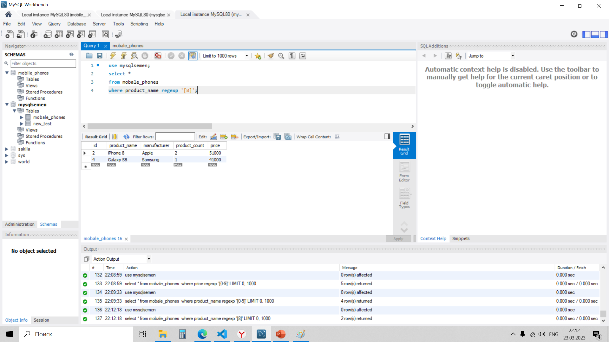

# Базы данных и SQL 
## Урок 1. Установка СУБД, подключение к БД, просмотр и создание таблиц

- ### Создайте таблицу с мобильными телефонами, используя графический интерфейс. Заполните БД данными

- код 
USE mysqlsemen; 
CREATE TABLE mobale_phones ( 
  id INT NOT NULL AUTO_INCREMENT, 
  product_name VARCHAR(45) NOT NULL DEFAULT, 
  manofacturer VARCHAR(45) NOT NULL DEFAULT, 
  product_count INT NOT NULL DEFAULT 0, 
  price INT NOT NULL DEFAULT 0, 
  PRIMARY KEY (id));  

#### - заполняем  
- код 
USE mysqlsemen; 
insert into mobale_phones (product_name, manufacturer, product_count, price) 
values 
('iPhone X', 'Apple', 3, 76000), 
('iPhone 8', 'Apple', 2, 51000), 
('Galaxy S9', 'Samsung', 2, 56000), 
('Galaxy S8', 'Samsung', 1, 41000), 
('P20 Pro', 'Huawei', 5, 36000);

- ### Выведите название, производителя и цену для товаров, количество которых превышает 2
- код 
use mysqlsemen; 
select product_name, manufacturer, price  
from mobale_phones  
where product_count > 2; 

- ### Выведите весь ассортимент товаров марки “Samsung”
- код 
use mysqlsemen; 
select product_name, price  
from mobale_phones  
where manufacturer = "Samsung"; 

- ### найти товары в которых есть упоминание "Iphone"
- код 
use mysqlsemen; 
select * 
from mobale_phones 
where product_name regexp  "IPhone"; 

- ### найти товары в которых есть упоминание "Samsung"
- код 
use mysqlsemen; 
select * 
from mobale_phones  
where manufacturer regexp  "Samsung"; 

- ### Товары в которых есть цыфры
- код  
use mysqlsemen; 
select * 
from mobale_phones  
where product_name regexp '[0-9]'; 

- ### Товары в которых есть цыфр 8

- код  
use mysqlsemen; 
select * 
from mobale_phones 
where product_name regexp '[8]'; 

